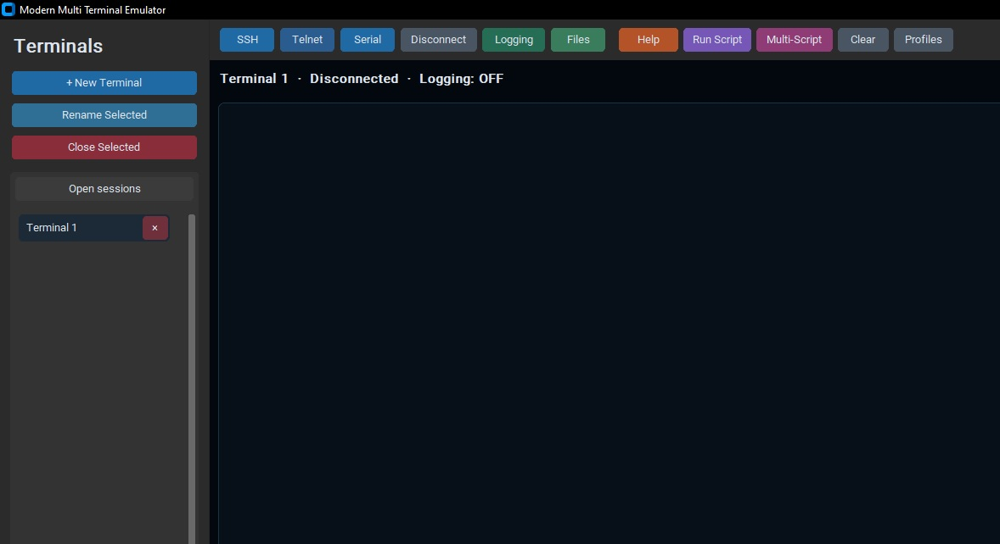

<div align="center">

# ⚡ Modern Multi Terminal Emulator 
### & DevOps Sequencer Suite

**The next-generation, cross-platform automation workbench & drop-in Tera Term replacement.**

[](https://www.python.org/)
[](https://github.com/TomSchimansky/CustomTkinter)
[]()
[](LICENSE)

---

</div>

## 📖 Overview

Network SREs and hardware developers are constantly forced to choose between **writing modern Python automation** and **supporting legacy Tera Term (`.ttl`) infrastructure**. 

**Modern Multi Terminal** bridges the gap. It is an enterprise-grade workbench that runs concurrent multi-protocol live sessions alongside a **Digital Audio Workbench (DAW)-style automation sequencer**—allowing teams to execute mixed legacy macros and Python scripts inside a unified, strobe-free interface.

---

## ✨ Engineering Highlights

### 🔌 Tri-Protocol Connection Engine
* **SSH-2:** Fully allocated PTY interactive shell streams powered by `paramiko`.
* **Hardware Serial:** Native `pyserial` bridge with live hardware discovery *(displays friendly driver names like `CP210x USB to UART Bridge (COM6)` rather than raw system paths)*.
* **Telnet:** Raw TCP socket engine featuring an automated background regex scrubber that strips binary `IAC (0xFF)` negotiation spam.

### 🧠 Sane VT100 Stream Caret 
* **True Stream Emulation:** Incoming packets insert strictly at the local green caret position (`"insert"`), never forcibly snapping the user's cursor to the bottom of the screen mid-sentence.
* **Anti-Bell Trap:** Silently vaporizes rogue Linux `\x07 (BEL)` audio packets before they can corrupt screen geometry or sniffer buffers.
* **Zero-Flicker Layout:** Fully decoupled widget memory arrays; tabs and scroll views mutate existing Tkinter properties rather than running `.destroy()` redraw loops.

### 🎛️ DAW Multi-Script Sequencer
* **Session Tab Routing:** Assign Row 1 (`login.ttl`) to *Terminal A*, and Row 2 (`scrape_routing_table.py`) to *Terminal B*. The GUI auto-flips tabs to follow active execution.
* **Smart Prompt Sniffer:** Background regex engine hunts for prompt signifiers (`$`, `#`, `>`) to graduate queue steps hands-free.
* **The Operator Gate:** If a script times out or throws an exception, execution freezes and triggers an OS audio alert, offering the engineer three choices: `[+15s Extend]`, `[Force Pass]`, or `[Abort]`.
* **Single-Bench Debugger:** Test Row 4 in isolation using the `► Single` button without waiting for Rows 1–3 to execute.

---


## 🏗️ Modular System Architecture

```text
modern_multi_terminal/
│
├── assets/
│   └── icon.ico                 # App branding & window taskbar resolution
├── Scripts/                     # This contain sample scripts
│
├── core/
│   ├── models.py                # Session state tracking & VT100 Textbox mutations
│   ├── connections.py           # Threaded SSH, Serial, and Telnet socket drivers
│   ├── script_engine.py         # Legacy .ttl Tokenizer & Python exec() global hooks
│   └── presets.py               # Static embedded macro download repository
│   └── theme.py                 # Contain terminal theme and pallet
│   └── sftp_hops.py             # for addition sshp hop jumper
│
├── gui/
│   ├── dialogs.py               # Modal views (Connection builders, Rename, Help)
│   └── daw_manager.py           # DAW Playlist Sequencer & Supervisor Engine
│   └── sftp_dialog.py           # UI for the jumper connection and file transfer between two systems
│
├── main.py                      # Application Bootstrap & Tkinter Mainloop
├── LICENSE.txt                  # BSD License 3 Clause
└── requirements.txt

```

---

## 🚀 Quickstart Guide

### 1. Requirements

Ensure you have **Python 3.10 or higher** installed on Windows, macOS, or Linux.

### 2. Installation

Clone the repository and install the 3 lightweight core dependencies:

```bash
git clone [https://github.com/abyshergill/modern_multi_terminal.git](https://github.com/abyshergill/modern_multi_terminal.git)
cd modern_multi_terminal

pip install -r requirements.txt

```

### 3. Launch

```bash
python main.py

```

---

## 📜 Automation Syntax Reference

The suite natively parses both formats side-by-side. You can drag both file types into the same Multi-Script playlist.

### Option A: Tera Term Macro (`.ttl`)

*Fully supports standard TTL runtime variables, inline comments, and termination hooks.*

```ini
; login_sequence.ttl
Prompt = '#'

connect '192.168.1.50 /telnet /port=23'
wait 'login:'
sendln 'admin'

wait 'Password:'
sendln 'supersecret'

wait Prompt
sendln 'show system uptime'
end

```

### Option B: Native Python (`.py`)

*Exposes injected global thread hooks directly to your standard Python code.*

```python
# login_sequence.py

# Programmatic socket handoff
connect_telnet("192.168.1.50", port=23)
wait(1.0)

send("admin")
wait(0.5)

send("supersecret")
wait(1.0)

send("show system uptime")
print("--- Automated Diagnostic Complete ---")

```

#### Available Injected Python Globals:

* `connect_ssh(host, username, password, port=22)`
* `connect_serial(port, baudrate, bytesize=8, parity="N", stopbits=1)`
* `connect_telnet(host, port=23)`
* `send(text, newline=True, delay=0.0)`
* `wait(seconds)` / `sleep(seconds)`

---

## 📂 Local System Directories

The emulator safely isolates its footprint to the user's home directory:

* **SSH Profiles:** `~/.modern_multi_terminal_emulator/ssh_profiles.json`
* **Stream Session Logs:** `~/.modern_multi_terminal_emulator/logs/*.log`

---

## 🛡️ License & Contact

Distributed under the **BSD 3-Clause License**. See `LICENSE` for more information.

**Project Architect:** DevOps Suite Development Team

*Found a bug or need an enterprise protocol scraper added?* **[Click here to open an Issue or reach out to the Creator ↗](https://github.com/abyshergill)**
